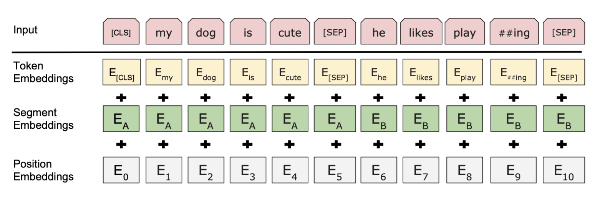

BERT was pre-trained with two specific tasks: Masked Language Model and Next sentence prediction. 
1. data preprocess
   1. clean data, get token, and convert them into index (include Bert specific token)
   2. build bert embedding 
      
      1. the input of bert is embedding (word embedding + segment embedding + position embedding)
      > What is segment embedding?   
      A segment embedding separates two sentences from each other and they are generally defined as 0 and 1. 
      
      > What is position embedding?   
      A position embedding gives position to each embedding in a sequence.

   3. make mask 
      1. BERT randomly assigns masks to 15% of the sequence.
      2. Once we replace 15% of the words with [MASK] tokens, we will add padding. Padding is usually done to make sure that all the sentences are of equal length.
      > eg:  “The cat is walking. The dog is barking at the tree”   
      
      then with padding, it will look like this: 
      
      > “[CLS] The cat is walking [PAD] [PAD] [PAD]. [CLS] The dog is barking at the tree.” 
   
      The length of the first sentence is equal to the length of the second sentence. 

